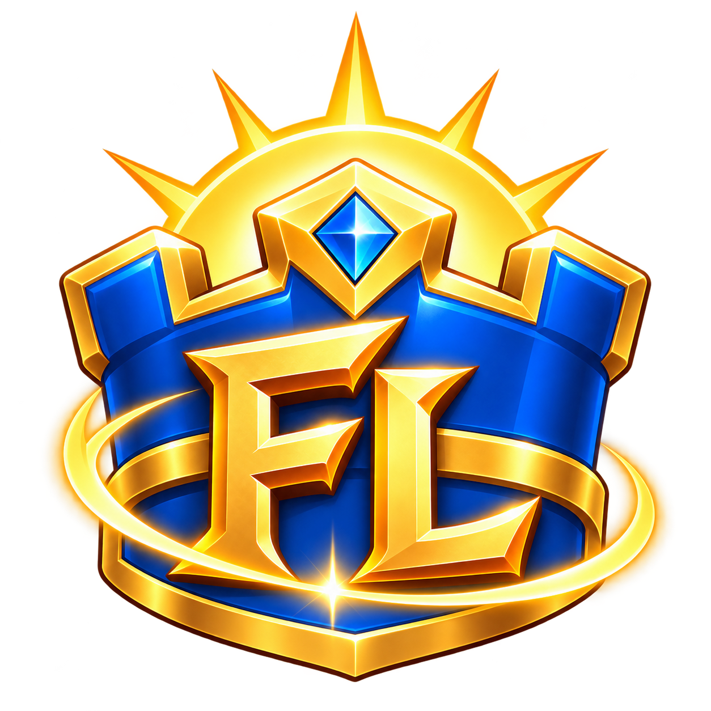
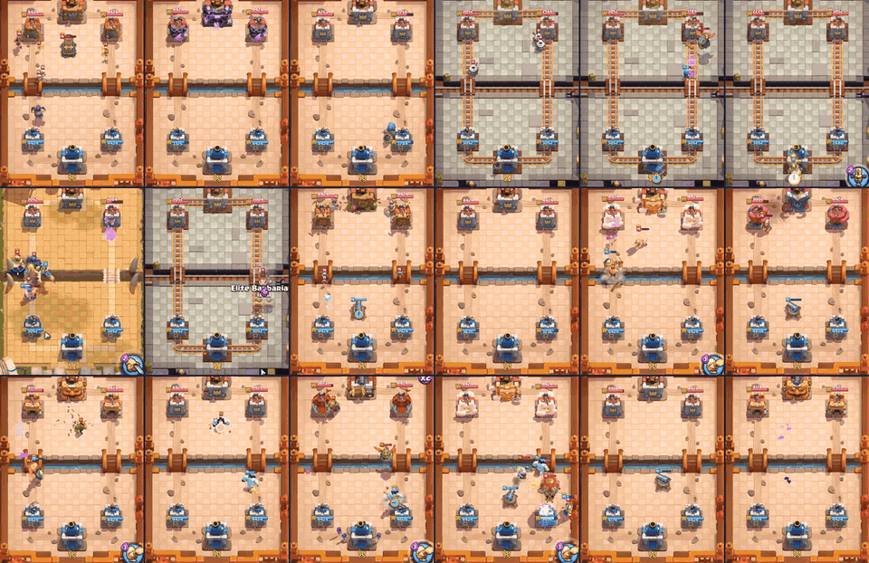
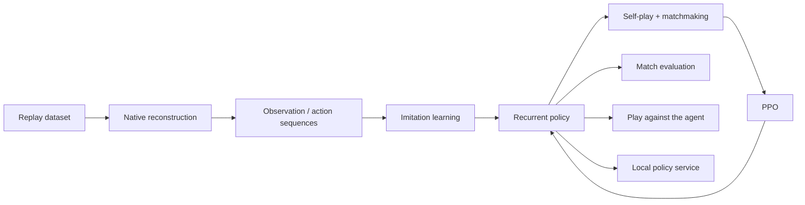

<p align="center">
  
</p>
<h1 align="center">FirstLight CR</h1>
<p align="center"><strong>From replays to agents. From self-play to the arena.</strong></p>
<p align="center">Train Clash Royale agents and play offline, with imitation learning and PPO self-play.</p>
<p align="center"><strong>English</strong> · <a href="README.zh-CN.md">简体中文</a></p>
<p align="center">
  <a href="LICENSE"></a>
  
  
  <a href="https://huggingface.co/datasets/VanguardX101/IL_Replay"></a>
</p>
<p align="center">
  <a href="docs/getting_started.md">Installation</a> ·
  <a href="docs/training.md">Training</a> ·
  <a href="docs/training_history.md">Training history</a> ·
  <a href="checkpoints/README.md">Models</a> ·
  <a href="docs/architecture.md">Architecture</a> ·
  <a href="docs/policy_service.md">Policy API</a>
</p>

<p align="center">
  
</p>

## Pretrained models

**We have trained a strong general-purpose Clash Royale agent and a Hall of Fame–level 2.6 Hog Cycle specialist.**

The author reached Hall of Fame on an account using the Hog specialist. Read the [training history](docs/training_history.md) for the five-model progression, the fixed-IL detour, and model evaluation results.

Choose **General** to try different decks, or a **Hog 2.6 specialist** for Hog Cycle. The models are included in the repository; follow the [quick start](#quick-start) to play against them. The [model guide](checkpoints/README.md) explains each checkpoint and how to evaluate it.

## Features

The project provides an offline battle environment, replay reconstruction tools, training code, and pretrained models.

- **Native battle environment.** Headless and rendered execution, structured observations, card deployment and abilities, with Python `reset` / `step` interfaces.
- **Imitation learning.** Reconstruct Parquet replays in the engine and build observation/action sequences for IL training.
- **Self-play reinforcement learning.** PPO with matchmaking, opponent pools, resident simulation, and distributed collection.
- **Models and inputs.** The V4 actor-critic uses card features, entity relations, spatial features, and recurrent memory. Training, evaluation, and local inference use the same model and input format.
- **Match and replay interface.** Play against a model, control both sides manually, or watch training and collected replays in one offline VM.
- **Source-level access.** C/C++ probe, hooks, function addresses, layouts, APK build tools, Python environments, and learning code are included.

**122 supported cards · 5 included checkpoints · 252,238 replays · 17,836,160 actions**

See [compatibility data](native_runner/data/competitive/README.md) for the cards and forms supported by each version. Download the replay dataset from [Hugging Face](https://huggingface.co/datasets/VanguardX101/IL_Replay).

## Training flow



See the [architecture guide](docs/architecture.md) for source entry points and data formats.

## Quick start

**Desktop:** Windows, Python 3.12 with Tkinter, and a dedicated rooted MuMu instance with ARM64 application support. CPU inference is supported. Native builds require JDK 17, Android NDK, and SDK build-tools.

Run from the repository root:

```powershell
python -m venv .venv
.\.venv\Scripts\python.exe -m pip install -r requirements.txt
Copy-Item .env.example .env
.\.venv\Scripts\python.exe tools/check_install.py
```

Fill the Python, VM, and build-tool settings in `.env` using the [installation guide](docs/getting_started.md). The supported engine is **Null’s Royale 15.535.13 / arm64-v8a with content update 15.535.86**.

**First, install and open the original APK yourself in the dedicated VM, let the game finish downloading the matching update, then exit it.** Keep the original APK as `user-provided/nulls-royale.apk` and build the offline engine:

```powershell
./build_offline_engine.ps1 `
  -InputApk ./user-provided/nulls-royale.apk `
  -OutputApk ./build/cr-ai-offline.apk
./install_offline_engine.ps1 -Apk ./build/cr-ai-offline.apk
.\launch_interface.cmd
```

Select a checkpoint and both decks on **模型对局 / Model match**, then start. The model plays the top side; you control the bottom side through the overlay. Matches use level 11 and native deployment timing.

| Console page | Explore |
| --- | --- |
| Model match | Play against an included or newly trained checkpoint |
| Manual native match | Control both sides to examine interactions |
| Training replay | Inspect exported native battle trajectories |
| Collected replay | Reconstruct matches from a Parquet dataset |

## Train and evaluate

Start with [IL_Replay](https://huggingface.co/datasets/VanguardX101/IL_Replay) for imitation learning, or generate a small workflow example with `python tools/make_demo_data.py`. The [training guide](docs/training.md) covers cache generation, IL, engine clusters, Linux AVD preparation, and distributed PPO.

To compare two included checkpoints, stop any console task and run:

```powershell
./native_runner/start_offline.ps1
.\.venv\Scripts\python.exe -m native_runner.training.v4.evaluate `
  --checkpoint-a ./checkpoints/General/checkpoint-step-00000460.pt `
  --checkpoint-b ./checkpoints/IL/checkpoint-step-00029396.pt `
  --games 2 --output ./evaluations/comparison
```

The two-game example checks that the evaluator runs. For model comparisons, set the game count with `--games`, decks and levels with `--match-config`, and the starting seed with `--seed`. See [model evaluation](checkpoints/README.md#evaluation--模型评测) for output files and metrics. To integrate your own actor loop, use the [JSON-lines policy service](docs/policy_service.md).

## Documentation

All guides include English and Chinese.

| Guide | Contents |
| --- | --- |
| [Getting started](docs/getting_started.md) | Requirements, `.env`, local build, installation, and console |
| [Training history](docs/training_history.md) | Five main models, experiments, results, and playstyle tradeoffs |
| [Training](docs/training.md) | Replay cache, IL, batch simulation, Linux guests, and PPO |
| [Architecture](docs/architecture.md) | Environment, policy, training, and replay source map |
| [Models](checkpoints/README.md) | Model selection, loading, and evaluation metrics |
| [Policy service](docs/policy_service.md) | Recurrent episode lifecycle and request protocol |
| [Compatibility data](native_runner/data/competitive/README.md) | Card support, model catalogs, and version maintenance |
| [Checks](docs/validation.md) | Environment checks, tests, and runtime result checks |

## License

FirstLight CR is independently developed and licensed under [Apache-2.0](LICENSE). It does not connect to Supercell official servers, operate official accounts, or represent or affiliate with Supercell. Third-party game binaries, resources, and modified clients are not distributed. Users provide the supported APK locally; rights to that software and its resources remain with their owners. See [NOTICE](NOTICE).
