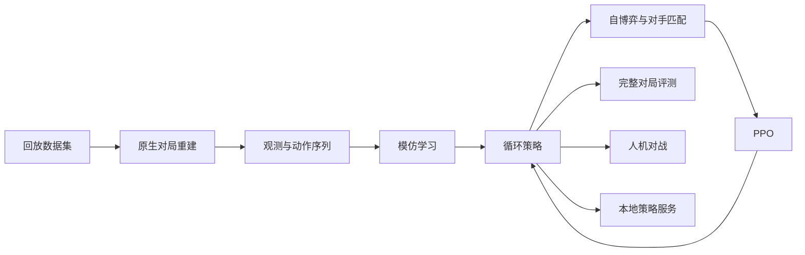

<p align="center">
  
</p>
<h1 align="center">FirstLight CR</h1>
<p align="center">用于《皇室战争》AI 训练和离线对战，支持模仿学习与 PPO 自博弈。</p>
<p align="center"><a href="README.md">English</a> · <strong>简体中文</strong></p>
<p align="center">
  <a href="LICENSE"></a>
  
  
  <a href="https://huggingface.co/datasets/VanguardX101/IL_Replay"></a>
</p>
<p align="center">
  <a href="docs/getting_started.md">安装指南</a> ·
  <a href="docs/training.md">训练指南</a> ·
  <a href="docs/training_history.md">训练历程</a> ·
  <a href="checkpoints/README.md">模型</a> ·
  <a href="docs/architecture.md">系统架构</a> ·
  <a href="docs/policy_service.md">策略 API</a>
</p>

<p align="center">
  
</p>

> **视频：模型冲击名人堂与 AI 架构设计讲解**
>
> [观看中文版（哔哩哔哩）](https://www.bilibili.com/video/BV17Zb46JE9h) · [Watch in English (YouTube)](https://www.youtube.com/watch?v=TpfhzVlXWqw&lc=UgyyW1z5iYdLX8BZ0xl4AaABAg)

## 预训练模型

**General 是较强的通用模型；作者使用 2.6 速猪专精模型打上了名人堂。**

[训练历程](docs/training_history.md)记录了模型的训练过程和评测结果。

想尝试不同卡组，选择 **General**；想体验 2.6 速猪，选择 **Hog 2.6 specialist**。两个模型均在仓库中；文件用途与评测方法见[模型说明](checkpoints/README.md)。

## 主要功能

- **原生对局环境。** 支持无渲染与可视化运行，提供结构化观测、下牌和技能动作，以及 Python `reset` / `step` 接口。
- **模仿学习。** 在引擎中重建 Parquet 回放，生成观测与动作序列，用于 IL 训练。
- **自博弈强化学习。** PPO 配合对手匹配、对手池、常驻模拟实例与分布式采集。
- **模型与输入。** V4 actor-critic 使用卡牌、实体关系、空间特征和循环记忆。训练、评测和本地推理使用同一套模型与输入格式。
- **本地对战与回放界面。** 支持模型对战、双边手动控制、训练回放与采集回放，共用一个离线 VM。
- **项目源码。** 包含 probe、APK 构建工具、对局环境和训练代码。

**122 张支持卡牌 · 5 个随附模型 · 252,238 场回放 · 17,836,160 条动作**

各版本支持的卡牌和形态见[兼容性说明](native_runner/data/competitive/README.md)。回放数据集在 [Hugging Face](https://huggingface.co/datasets/VanguardX101/IL_Replay) 下载。

## 训练流程



各模块的源码入口和数据格式见[架构指南](docs/architecture.md)。

## 快速开始

新机器安装或交给 coding agent 配置时，请按[安装指南](docs/getting_started.md)操作。以下是摘要。

**桌面环境：** Windows、含 Tkinter 的 Python 3.12，以及普通官网版 MuMu Player 中一个 **Android 12**、开启 root、支持 ARM64 应用的实例。模型支持 CPU 推理。从源码构建离线 APK 才需要 JDK 17、Android NDK 与 SDK build-tools；运行已经构建好的 APK 不需要这些工具。

在仓库根目录执行：

```powershell
python -m venv .venv
.\.venv\Scripts\python.exe -m pip install -r requirements.txt
Copy-Item .env.example .env
```

按[安装指南](docs/getting_started.md)填写 `.env` 中的 Python、VM 和构建工具配置。支持的引擎组合为 **Null’s Royale 15.535.13 / arm64-v8a，配合更新资源 15.535.86**。

**先在选定的 MuMu 实例中安装并打开未修改的原始 APK，让游戏自然更新，确认能进入正常游戏大厅后退出。** 将原始 APK 保留为 `user-provided/nulls-royale.apk`。先核对原始 APK 和已下载资源，再构建、注入 probe：

```powershell
./check_original_game.ps1 -InputApk ./user-provided/nulls-royale.apk
./build_offline_engine.ps1 `
  -InputApk ./user-provided/nulls-royale.apk `
  -OutputApk ./build/cr-ai-offline.apk
./install_offline_engine.ps1 -Apk ./build/cr-ai-offline.apk
```

安装后启动界面：在项目上级目录运行 `Firstlight_CR\launch_interface.cmd`，或在仓库根目录运行 `./launch_interface.cmd`。

## 训练与评测

使用 [IL_Replay](https://huggingface.co/datasets/VanguardX101/IL_Replay) 开始模仿学习，也可以先执行 `python tools/make_demo_data.py` 生成小规模流程样例。[训练指南](docs/training.md)覆盖缓存生成、IL、引擎集群、Linux AVD 准备及分布式 PPO。

比较两个随附模型时，先停止控制台任务，再执行：

```powershell
./native_runner/start_offline.ps1
.\.venv\Scripts\python.exe -m native_runner.training.v4.evaluate `
  --checkpoint-a ./checkpoints/General/checkpoint-step-00000460.pt `
  --checkpoint-b ./checkpoints/IL/checkpoint-step-00029396.pt `
  --games 2 --output ./evaluations/comparison
```

用 `--games` 设置对局数，`--match-config` 指定卡组与等级，`--seed` 设置起始种子。结果文件和指标见[模型评测](checkpoints/README.md#evaluation--模型评测)。接入自己的 actor 循环可使用 [JSON 行策略服务](docs/policy_service.md)。

## 文档

| 指南 | 内容 |
| --- | --- |
| [安装指南](docs/getting_started.md) | 依赖、`.env`、原版游戏更新与离线安装 |
| [训练历程](docs/training_history.md) | 五个核心模型、实验转折、评测结果与打法取舍 |
| [训练指南](docs/training.md) | 回放缓存、IL、批量模拟、Linux guest 与 PPO |
| [系统架构](docs/architecture.md) | 环境、策略、训练与回放的源码导览 |
| [模型](checkpoints/README.md) | 模型选择、加载与评测指标 |
| [策略服务](docs/policy_service.md) | 循环策略的对局生命周期与请求协议 |
| [兼容性数据](native_runner/data/competitive/README.md) | 卡牌支持、模型目录与版本维护 |
| [检查指南](docs/validation.md) | 环境检查、测试命令与运行结果检查 |

## 许可

FirstLight CR 是独立的离线项目，采用 [Apache-2.0](LICENSE)，与 Supercell 无关联。仓库不分发游戏 APK 或资源；用户需在本地提供指定 APK。详见 [NOTICE](NOTICE)。
