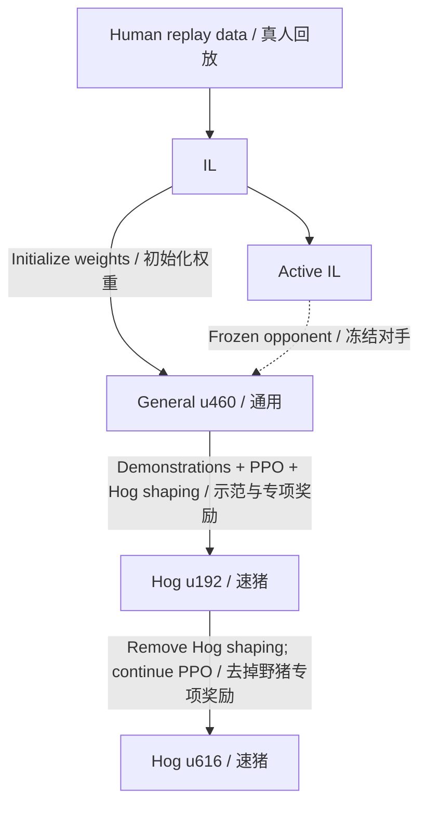

# Training history · 训练历程

[English home](../README.md) · [中文首页](../README.zh-CN.md) · [Models / 模型](../checkpoints/README.md) · [Training commands / 训练命令](training.md)

FirstLight CR developed through five main models: **IL, Active IL, General u460, Hog u192, and Hog u616**. The work involved learning to start a battle, finding useful opponents, and balancing a recognizable Hog Cycle playstyle with winning. Early high win rates against a passive IL opponent initially obscured those problems.

FirstLight CR 的训练主线围绕五个模型展开：**普通 IL、active IL、通用 u460、速猪 u192 和速猪 u616**。训练过程中，我们逐步解决开局消极、对手选择和速猪行为学习的问题，也经历过对被动 IL 胜率很高、实战表现却不理想的歪路。

## Five main models · 五个核心模型

The descriptions below summarize the author's hands-on observations across decks and training stages. Exact evaluation results and their conditions are given later on this page.

下表概括作者在不同卡组和训练阶段中的实战观察；具体评测数字及条件列在后文。

| Model / 模型 | Character / 特点 | Role / 作用 |
| --- | --- | --- |
| **IL** | Human-like play across decks, but modest overall strength / 各类卡组的打法都比较像真人，但整体实力一般 | Imitation-learning foundation / 模仿学习底座 |
| **Active IL** | More proactive; better with expensive decks, but cheap-deck play regressed / 更积极，大费卡组玩得好一些，小费卡组有所退化 | A more active opponent for subsequent PPO / 为后续 PPO 提供更积极的对手 |
| **General u460** | Stronger with cheap decks; expensive-deck play is more ordinary / 小费卡组玩得好一些，大费表现一般 | General-purpose RL model and the specialist's starting point / 通用强化模型，也是速猪专精的起点 |
| **[Hog specialist 1 — u192](../checkpoints/2_6hog_expert/hog26-specialist1.pt)** | The more proactive Hog specialist / 更积极一些的速猪模型 | Specialist developed with demonstrations and Hog-specific shaping / 经示范监督和野猪专项奖励训练出的阶段成果 |
| **[Hog specialist 2 — u616](../checkpoints/2_6hog_expert/hog26-specialist2.pt)** | The more passive Hog specialist, with stronger measured match results / 更被动一些，但模型对战成绩更强的速猪模型 | Final main specialist after removing Hog-specific shaping / 移除野猪专项奖励后得到的最终核心模型 |

“More proactive” is a comparison between these specialists. u192 can still wait for the opponent under argmax decoding; it did not eliminate passive openings in every matchup.

“更积极”是两个速猪模型之间的相对特点。u192 在 argmax 下也可能等待对手先动，并没有解决所有 matchup 的被动开局。

Active IL influenced u460 as an opponent: **u460's weights were initialized from the original IL**, not Active IL. The u460 → u192 arrow summarizes several intermediate runs. Update numbers are local to a run; changes in recipe often started a new optimizer and reset the counter.

active IL 通过对手身份参与 u460 的训练：**u460 的初始化权重仍来自原始 IL**。u460 → u192 之间包含数轮中间训练。update 编号属于各自的 run；调整配方时，多次只继承权重、重建优化器并重新计数。

## 1. Learn from human replays · 从真人回放开始

Imitation learning reconstructs recorded matches in the native engine and learns actions from the resulting observation sequences. The original IL learned recognizable play across many decks. It became both the weight initialization and a baseline opponent for PPO, although its overall strength remained modest.

模仿学习先在原生引擎中重建真人对局，再从观测序列中学习动作。普通 IL 在各种卡组上都学到了比较像真人的打法，整体实力一般，但为 PPO 提供了基础操作能力、初始化权重和基准对手。

The PPO infrastructure used 1,528 concurrent matches, 40-game-second rollout segments, and eight GPUs for distributed updates. Games and recurrent state continued across segments. Work on throughput was accompanied by fixes to level consistency and deployment legality; rejected actions were required to be zero before accepting a rollout for training.

PPO 基础设施采用 1,528 局并行、40 游戏秒分段 rollout 和八卡分布式更新，跨分段保留对局与循环状态。吞吐优化之外，还修复了等级一致性和部署合法性问题，并要求训练采集中的 rejected actions 严格为零。

## 2. The fixed-IL detour · 固定 IL 高胜率的歪路

An early experiment initialized the learner from IL and trained **100% current–IL**, with a frozen argmax IL opponent and no self-play or history pool. Its selected checkpoint reached **80.10%** wins against IL. Reviewing opponent actions changed the interpretation: **296 of its 306 wins** came from matches where IL took at most three non-WAIT actions.

早期为了验证 PPO，我们从 IL 初始化 learner，采用 **100% current–IL**：对手是冻结的 argmax IL，没有自博弈，也没有 history pool。选出的模型对 IL 胜率达到 **80.10%**。但检查对手动作后发现，**306 场胜利中有 296 场**来自 IL 最多只做过三次非 WAIT 动作的对局。

The same weakness appeared later in a separate self-play-heavy experiment. In five targeted Hog-versus-IL matches, the learner won all five while IL never played a card. The learner first acted around game seconds **196–240**, and each match ended only **17–26 seconds later**. These replay timings belong to that later experiment, not the original 100% current–IL run; they describe time before the actual finish, not time remaining on a preset match clock.

后来另一轮以自博弈为主的实验也暴露了相同问题。五局定向速猪对 IL 评测全部获胜，但 IL 全程没有出牌；learner 直到约 **第 196–240 秒**才首次出手，随后 **17–26 秒**比赛便结束。这组回放属于后来的实验，不能混为最初的 100% current–IL；这里的时间差是距实际终局的时间，并非距预设时限。

The high fixed-IL win rate was therefore selecting for exploitation of a passive opponent, rather than demonstrating strong play in normal battles. This did not establish that every PPO result was invalid, but it invalidated using that win rate alone as evidence of general strength. Replays, opponent activity, and hands-on play became essential checks alongside wins and losses.

这些高胜率在很大程度上筛选出了利用被动对手的策略，不能证明模型在正常交战中很强。这不代表所有 PPO 结果都无效，却推翻了仅凭这条胜率曲线判断通用实力的做法。此后，回放、对手出牌情况和实战体验都成为胜负之外的重要检查。

## 3. Build Active IL · 训练积极版 IL

Active IL was trained to retain IL-like competence while becoming more willing to engage. Starting from original IL, we used **50% self-play and 50% frozen IL**, disabled forced-opening fallback, and added elixir-overflow penalties. An initial stronger-penalty phase was followed by a gentler phase; the selected checkpoint from the latter is **Active IL u30**.

active IL 的目标是在保留 IL 基础能力的同时，让模型更愿意开战。从原始 IL 出发，使用 **50% 自博弈＋50% 冻结 IL**，关闭强制开局 fallback，加入圣水溢出惩罚。先用较强惩罚修正行为，再减轻惩罚继续训练，最终选出第二阶段的 **active IL u30**。

It played expensive decks better, but cheap-deck play regressed: becoming eager to spend elixir could interfere with timing and cycling. It nevertheless supplied a useful active opponent. **Active IL is a PPO-adjusted model, not simply original IL with a forced-action rule.**

它的大费卡组表现更好一些，小费卡组却有所退化：更急于花掉圣水，有时会破坏等待、过牌和进攻节奏。即便如此，它仍提供了重要的积极对手。**active IL 是经过 PPO 行为调整的模型，并非给原始 IL 加一条强制出牌规则。**

## 4. Train General u460 · 得到通用 u460

The successful general-purpose run again initialized from **original IL**. Half the matches were self-play. In the fixed-opponent half, the opponent's average deck cost selected its policy: **original IL for cost ≤3, Active IL for cost >3**. Elixir-overflow grace and separate overflow timers were also corrected during this development stage.

成功的通用训练再次从**原始 IL**初始化。一半对局是自博弈；另一半按固定对手所用卡组的均费选择策略：**≤3 费用原始 IL，>3 费用 active IL**。这一阶段也修正了圣水溢出的宽限期与独立计时逻辑。

The selected **u460** was a useful general-purpose improvement and the foundation for specialization. In hands-on play it was stronger with cheap decks, while expensive-deck performance was more ordinary. It still tended to wait on an empty arena under argmax; stronger battle play and proactive openings remained separate goals.

选出的 **u460** 成为可用的通用强化模型，也成为后续专精的底座。实战中它的小费卡组玩得更好，大费表现一般。但 argmax 下空场等待的问题仍然存在，交战实力和主动开局依旧是两件事。

## 5. Teach Hog Cycle behavior · 训练更积极的 u192 速猪

The specialist always used **Evolved Cannon, Evolved Skeletons, Hero Musketeer, Hog Rider, Ice Golem, Ice Spirit, Fireball, and The Log**. Initial attempts from original IL struggled, so development moved to u460 initialization. The main fixed-opponent mixture became **40% original IL and 60% u460**.

专精模型固定使用**觉醒加农炮、觉醒骷髅兵、精英火枪手、野猪骑士、冰人、冰精灵、火球和滚木**。最初从原始 IL 出发的尝试效果不佳，随后改从 u460 初始化，主要固定对手组合为 **40% 原始 IL＋60% u460**。

Increasing Hog deployment rewards made the model play more Hogs, but often too late. Real Hog replay demonstrations supplied more direct supervision for actions and opening decisions. After several short PPO-plus-imitation runs, we selected an intermediate policy, disabled imitation supervision, and continued PPO. Later rounds shaped the first Hog's timing and tracked difficult decks separately for each opponent model. The selected stage result was **u192**.

增加下猪奖励让模型更愿意下猪，却经常只是到后半场才多下。真实速猪回放为动作和开局提供了更直接的监督。经过数轮 PPO＋模仿短训，选出中间模型，关闭模仿监督继续 PPO；之后再调整首猪时间奖励，并按对手模型分别统计困难卡组，最终得到阶段成果 **u192**。

u192 is the more proactive specialist in this mainline. Its training included explicit signals about Hog use and opening timing, although deterministic evaluation still exposed passive openings against some opponents.

u192 是主线中更积极一些的速猪模型。训练中明确教过下猪和开局时机，但确定性评测仍暴露出它面对部分对手时等待先手的问题。

## 6. Let match outcomes lead · 得到更被动的 u616 速猪

Starting from u192 with a fresh optimizer, we removed **all Hog-specific rewards and penalties**, while retaining terminal outcomes, tower-health shaping, and elixir-overflow penalties. Demonstration supervision remained off. The opponent mixture stayed at **40% IL / 60% u460**, with opponent decks drawn as **30% focus / 40% weighted / 30% hard**.

从 u192 加载权重并重建优化器后，我们移除**全部野猪专项奖励和惩罚**，保留终局胜负、塔血塑形和圣水溢出惩罚，模仿监督继续关闭。对手仍为 **40% IL / 60% u460**；对手卡组分布为 **30% 主流 / 40% 加权抽样 / 30% 困难卡组**。

A longer PPO run produced **u616**, the final main specialist. Match results improved, while its play became more passive. Later attempts to reduce overflow and accidental King Tower activation changed behavior, but did not establish a stronger replacement. The mainline therefore retains original u616.

较长的 PPO 训练得到最终核心模型 **u616**。它的模型对战成绩提高了，打法却变得更被动。后来尝试修正溢费和误开国王塔，虽然改变了行为，但没有确立更强的替代版本，因此主线保留原始 u616。

## Results and practical play · 评测与实战

These are historical evaluations, not new runs of the release's quick-start command. The general evaluation used 382 mirrored games per opponent, covering 172 candidate decks. Specialist evaluations used 760 games per opponent with the candidate fixed to the Hog deck. All rows below use argmax for both models and report **wins / total games**.

以下是历史评测，并非重新运行发布版快速开始命令所得。通用评测每个对手 382 局镜像赛程，候选模型使用 172 套卡组；专精评测每个对手 760 局，候选固定速猪。表中双方均用 argmax，数字为**胜场 / 总局数**。

| Candidate / 候选 | Original IL / 原始 IL | Active IL | General u460 |
| --- | ---: | ---: | ---: |
| General u460, mixed decks / 通用卡组 | 73.30% | 60.21% | — |
| Hog u192 / 固定速猪 | 84.74% | 84.08% | 79.74% |
| Hog u616 / 固定速猪 | 89.87% | 86.97% | 88.03% |
| u616, mixed decks / 通用卡组 | 66.75% | 60.73% | 59.16% |

In these evaluations, **original IL alone received one forced first action if it had not acted by 15 seconds**. Active IL and u460 had no such fallback. This condition matters when reproducing results; the release's basic evaluator example is not the historical evaluation protocol. General-deck and specialist rows use different task distributions and should not be treated as one continuous win-rate curve.

这些评测中，**只有原始 IL 在 15 秒仍未出牌时被强制执行一次首次动作**；active IL 和 u460 没有这项 fallback。复现时必须保留这一条件，发布版基础评测示例并不等同于历史评测协议。通用卡组与固定速猪是不同的任务分布，不能把各行直接连成一条胜率提升曲线。

u616 retained useful general play: even excluding every candidate deck containing Hog Rider, it won **59.45%** against u460. It was not uniformly better, however: its general-deck result against original IL was **6.54 percentage points below** historical u460. Specialization changed the balance of capabilities rather than improving every matchup.

u616 仍保留了通用能力：完全排除己方含野猪的卡组后，对 u460 胜率仍为 **59.45%**。但它并非全面升级，通用卡组对原始 IL 的胜率比历史 u460 **低 6.54 个百分点**。专精改变了能力分布，并不是每个方向都提高。

**The project's author reached Hall of Fame on an account using the Hog specialist.** This hands-on result is the basis for the project's “Hall of Fame–level” description. It is an author-reported account achievement, separate from the fixed model-versus-model evaluations above.

**项目作者使用速猪模型，将一个账号打上了名人堂。** 这是项目“名人堂级”描述的实战依据，属于作者报告的账号成绩，与上面的固定模型对战评测分别记录。

The central lesson was to evaluate both strength and behavior: a higher win rate can accompany a more passive policy, and a more active policy can lose tactical quality. The five retained models make those tradeoffs visible.

这条训练历程最重要的经验是同时观察实力和行为：胜率提高可能伴随打法更被动，出手更积极也可能损害操作质量。保留这五个模型，正是为了呈现这些变化与取舍。
