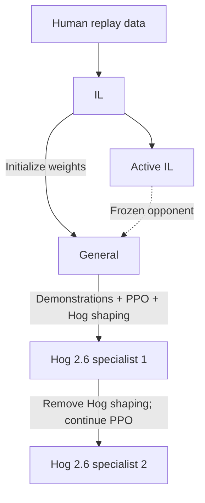

# Training history

[English home](../README.md) · [Models](../checkpoints/README.md) · [Training commands](training.md)

FirstLight CR developed through five main models: **IL, Active IL, General, Hog 2.6 specialist 1, and Hog 2.6 specialist 2**. The work involved learning to start a battle, finding useful opponents, and balancing a recognizable Hog Cycle playstyle with winning. Early high win rates against a passive IL opponent initially obscured those problems.

## Five main models

The descriptions below summarize the author's hands-on observations across decks and training stages. Exact evaluation results and their conditions are given later on this page.

| Model | Character | Role |
| --- | --- | --- |
| **IL** | Human-like play across decks, but modest overall strength | Imitation-learning foundation |
| **Active IL** | More proactive; better with expensive decks, but cheap-deck play regressed | A more active opponent for subsequent PPO |
| **General** | Stronger with cheap decks; expensive-deck play is more ordinary | General-purpose RL model and the specialist's starting point |
| **[Hog 2.6 specialist 1](../checkpoints/2_6hog_expert/hog26-specialist1.pt)** | The more proactive Hog specialist | Specialist developed with demonstrations and Hog-specific shaping |
| **[Hog 2.6 specialist 2](../checkpoints/2_6hog_expert/hog26-specialist2.pt)** | The more passive Hog specialist, with stronger measured match results | Final main specialist after removing Hog-specific shaping |

“More proactive” is a comparison between these specialists. Hog 2.6 specialist 1 can still wait for the opponent under argmax decoding; it did not eliminate passive openings in every matchup.

Active IL influenced General as an opponent: **General's weights were initialized from the original IL**, not Active IL. The General → Hog 2.6 specialist 1 arrow summarizes several intermediate runs. Changes in the training recipe often started a fresh optimizer while retaining the model weights.

## 1. Learn from human replays

Imitation learning reconstructs recorded matches in the native engine and learns actions from the resulting observation sequences. The original IL learned recognizable play across many decks. It became both the weight initialization and a baseline opponent for PPO, although its overall strength remained modest.

The PPO infrastructure used 1,528 concurrent matches, 40-game-second rollout segments, and eight GPUs for distributed updates. Games and recurrent state continued across segments. Work on throughput was accompanied by fixes to level consistency and deployment legality; rejected actions were required to be zero before accepting a rollout for training.

## 2. The fixed-IL detour

An early experiment initialized the learner from IL and trained **100% current–IL**, with a frozen argmax IL opponent and no self-play or history pool. Its selected checkpoint reached **80.10%** wins against IL. Reviewing opponent actions changed the interpretation: **296 of its 306 wins** came from matches where IL took at most three non-WAIT actions.

The same weakness appeared later in a separate self-play-heavy experiment. In five targeted Hog-versus-IL matches, the learner won all five while IL never played a card. The learner first acted around game seconds **196–240**, and each match ended only **17–26 seconds later**. These replay timings belong to that later experiment, not the original 100% current–IL run; they describe time before the actual finish, not time remaining on a preset match clock.

The high fixed-IL win rate was therefore selecting for exploitation of a passive opponent, rather than demonstrating strong play in normal battles. This did not establish that every PPO result was invalid, but it invalidated using that win rate alone as evidence of general strength. Replays, opponent activity, and hands-on play became essential checks alongside wins and losses.

## 3. Build Active IL

Active IL was trained to retain IL-like competence while becoming more willing to engage. Starting from original IL, we used **50% self-play and 50% frozen IL**, disabled forced-opening fallback, and added elixir-overflow penalties. An initial stronger-penalty phase was followed by a gentler phase; the selected checkpoint from the latter is **Active IL**.

It played expensive decks better, but cheap-deck play regressed: becoming eager to spend elixir could interfere with timing and cycling. It nevertheless supplied a useful active opponent. **Active IL is a PPO-adjusted model, not simply original IL with a forced-action rule.**

## 4. Train General

The successful general-purpose run again initialized from **original IL**. Half the matches were self-play. In the fixed-opponent half, the opponent's average deck cost selected its policy: **original IL for cost ≤3, Active IL for cost >3**. Elixir-overflow grace and separate overflow timers were also corrected during this development stage.

The selected **General** was a useful general-purpose improvement and the foundation for specialization. In hands-on play it was stronger with cheap decks, while expensive-deck performance was more ordinary. It still tended to wait on an empty arena under argmax; stronger battle play and proactive openings remained separate goals.

## 5. Teach Hog Cycle behavior

The specialist always used **Evolved Cannon, Evolved Skeletons, Hero Musketeer, Hog Rider, Ice Golem, Ice Spirit, Fireball, and The Log**. Initial attempts from original IL struggled, so development moved to General initialization. The main fixed-opponent mixture became **40% original IL and 60% General**.

Increasing Hog deployment rewards made the model play more Hogs, but often too late. Real Hog replay demonstrations supplied more direct supervision for actions and opening decisions. After several short PPO-plus-imitation runs, we selected an intermediate policy, disabled imitation supervision, and continued PPO. Later rounds shaped the first Hog's timing and tracked difficult decks separately for each opponent model. The selected stage result was **Hog 2.6 specialist 1**.

Hog 2.6 specialist 1 is the more proactive specialist in this mainline. Its training included explicit signals about Hog use and opening timing, although deterministic evaluation still exposed passive openings against some opponents.

## 6. Let match outcomes lead

Starting from Hog 2.6 specialist 1 with a fresh optimizer, we removed **all Hog-specific rewards and penalties**, while retaining terminal outcomes, tower-health shaping, and elixir-overflow penalties. Demonstration supervision remained off. The opponent mixture stayed at **40% IL / 60% General**, with opponent decks drawn as **30% focus / 40% weighted / 30% hard**.

A longer PPO run produced **Hog 2.6 specialist 2**, the final main specialist. Match results improved, while its play became more passive. Later attempts to reduce overflow and accidental King Tower activation changed behavior, but did not establish a stronger replacement. The mainline therefore retains original Hog 2.6 specialist 2.

## Results and practical play

These are historical evaluations, not new runs of the release's quick-start command. The general evaluation used 382 mirrored games per opponent, covering 172 candidate decks. Specialist evaluations used 760 games per opponent with the candidate fixed to the Hog deck. All rows below use argmax for both models and report **wins / total games**.

| Candidate | Original IL | Active IL | General |
| --- | ---: | ---: | ---: |
| General, mixed decks | 73.30% | 60.21% | — |
| Hog 2.6 specialist 1 | 84.74% | 84.08% | 79.74% |
| Hog 2.6 specialist 2 | 89.87% | 86.97% | 88.03% |
| Hog 2.6 specialist 2, mixed decks | 66.75% | 60.73% | 59.16% |

In these evaluations, **original IL alone received one forced first action if it had not acted by 15 seconds**. Active IL and General had no such fallback. This condition matters when reproducing results; the release's basic evaluator example is not the historical evaluation protocol. General-deck and specialist rows use different task distributions and should not be treated as one continuous win-rate curve.

Hog 2.6 specialist 2 retained useful general play: even excluding every candidate deck containing Hog Rider, it won **59.45%** against General. It was not uniformly better, however: its general-deck result against original IL was **6.54 percentage points below** historical General. Specialization changed the balance of capabilities rather than improving every matchup.

**The project's author reached Hall of Fame on an account using the Hog specialist.** This hands-on result is the basis for the project's “Hall of Fame–level” description. It is an author-reported account achievement, separate from the fixed model-versus-model evaluations above.

The central lesson was to evaluate both strength and behavior: a higher win rate can accompany a more passive policy, and a more active policy can lose tactical quality. The five retained models make those tradeoffs visible.
